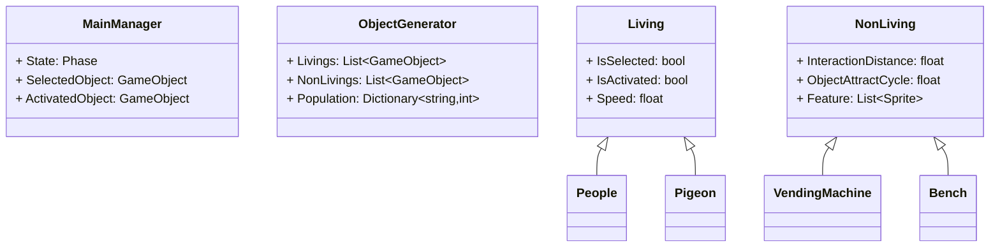

## **2.5D 횡스크롤 비주얼 게임**

> 자세한 사항은 [블로그](https://hyngng.github.io//posts/armonia-developing-cancelled/)에서 확인할 수 있습니다!

## **무엇을 만들었나**

[Living](https://github.com/hyngng/unity-armonia/blob/master/Assets/Scripts/Living/Living.cs) 부모 클래스를 만들고 [People](https://github.com/hyngng/unity-armonia/blob/master/Assets/Scripts/Living/People/People.cs)이나 [Pigeon](https://github.com/hyngng/unity-armonia/blob/master/Assets/Scripts/Living/Pigeon/Pigeon.cs) 등의 하위 클래스에서 참조하도록 만들었습니다.
