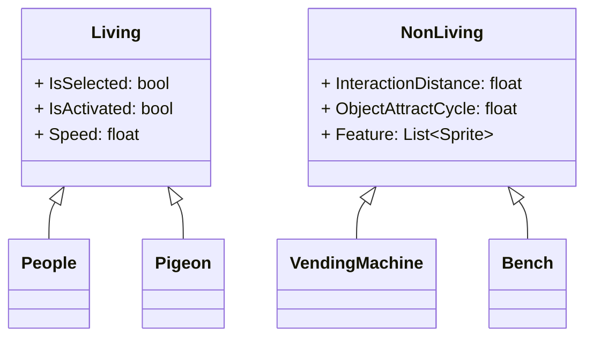

# README.md는 작성중!

## **2.5D 횡스크롤 형식의 비주얼 구경하는 게임**

> **자세한 사항은 [블로그](https://hyngng.github.io//posts/armonia-developing-cancelled/)에서 확인할 수 있습니다!**

<!--
## **무엇을 만들었나**

[Living](https://github.com/hyngng/unity-armonia/blob/master/Assets/Scripts/Living/Living.cs) 부모 클래스를 만들고 [People](https://github.com/hyngng/unity-armonia/blob/master/Assets/Scripts/Living/People/People.cs), [Pigeon](https://github.com/hyngng/unity-armonia/blob/master/Assets/Scripts/Living/Pigeon/Pigeon.cs) 등의 하위 클래스에서 참조하도록 만들었습니다.

이 구조는 [NonLiving](https://github.com/hyngng/unity-armonia/blob/master/Assets/Scripts/Non-Living/NonLiving.cs), [UtilityPole](https://github.com/hyngng/unity-armonia/blob/master/Assets/Scripts/Non-Living/UtilityPole.cs) 및 [VendingMachine](https://github.com/hyngng/unity-armonia/blob/master/Assets/Scripts/Non-Living/VendingMachine.cs)도 동일합니다.
-->
